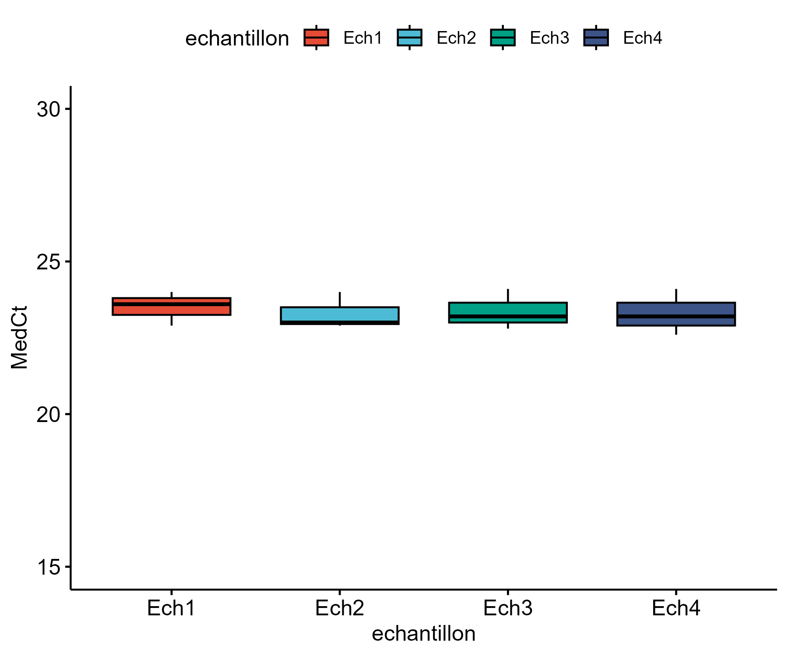
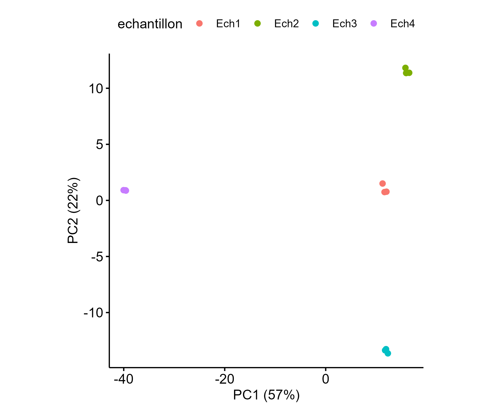
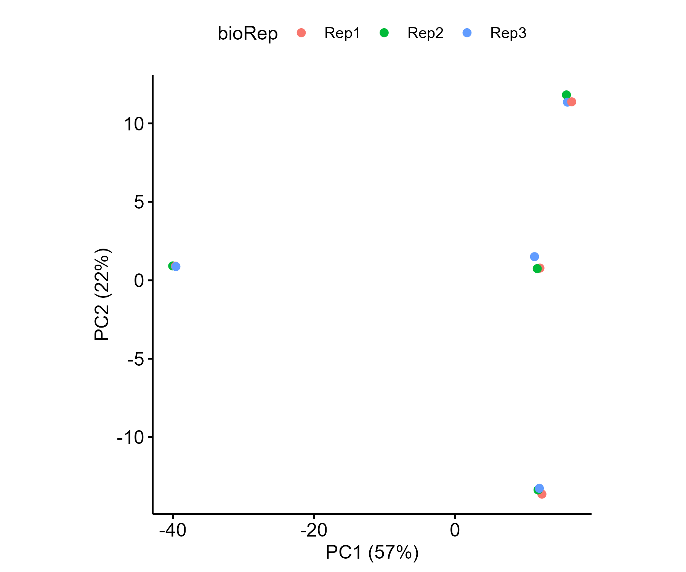
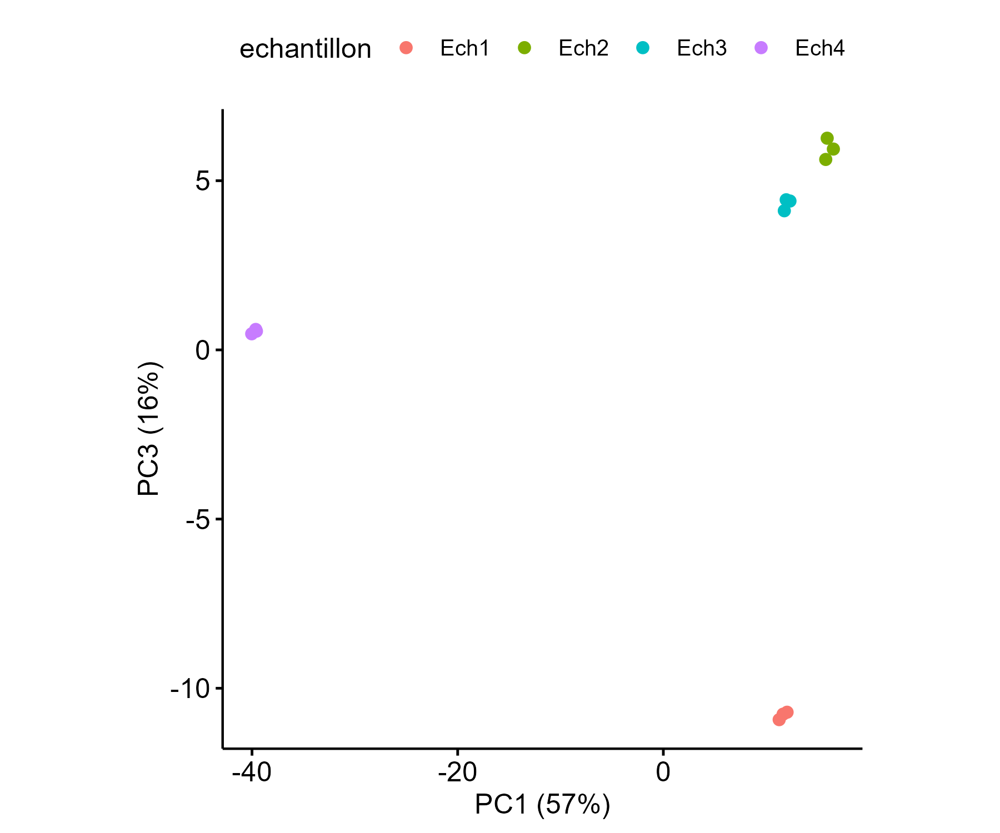
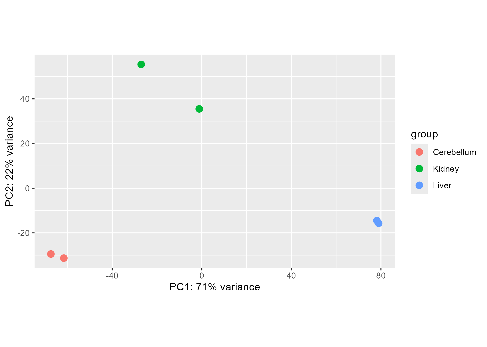
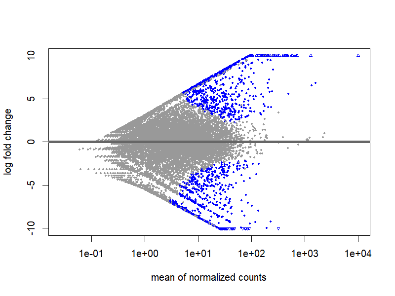
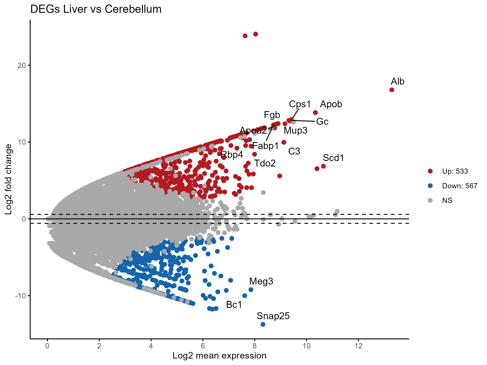
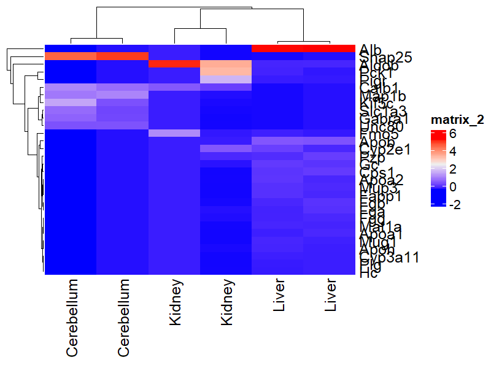
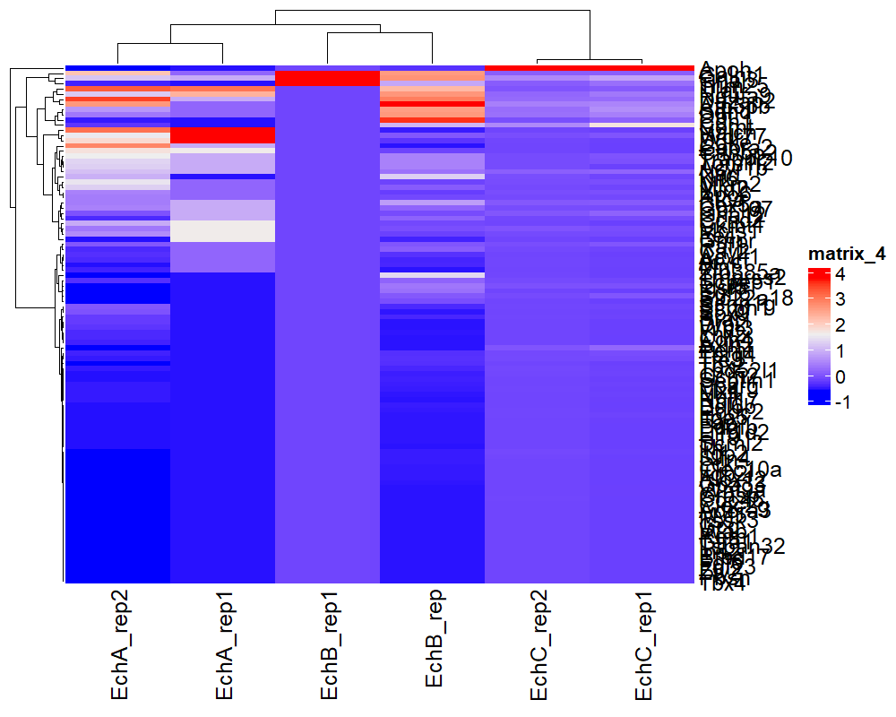
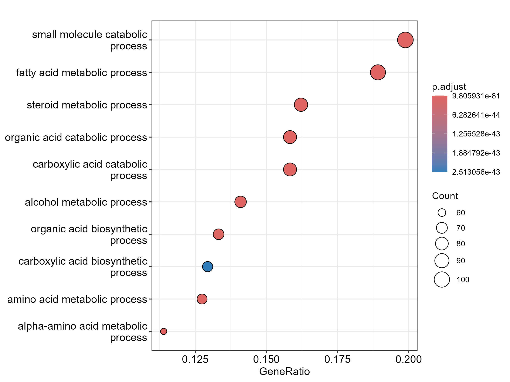

# 🧬 RNAseq-and-RTqPCR-project

Scripts R et visualisations issues d’un projet académique combinant RNA-Seq et RT-qPCR, réalisé en Licence 3 dans le cadre d’un TD sur l’analyse de données transcriptomiques.

---

##  Objectif du projet

Explorer et comparer les profils d’expression génique à partir de données RT-qPCR et RNA-Seq, à différents stades cellulaires ou types de tissus.  
L’objectif : mobiliser des outils statistiques et graphiques sous R pour identifier des régulations d’intérêt biologique.

---

## 🧰 Outils et packages utilisés

- **DESeq2** : analyse différentielle des gènes (RNA-Seq)
- **ggplot2**, **ggpubr** : visualisations graphiques
- **tidyverse**, **dplyr**, **tidyr** : manipulation et nettoyage de données  
- **ComplexHeatmap** : représentation de matrices d’expression
- **clusterProfiler**, **org.Mm.eg.db** : enrichissement fonctionnel (GO)
- **goseq** : analyse GO complémentaire

---

##  Ce que ce projet m’a appris

- Lire, nettoyer et formater des données transcriptomiques (RT-qPCR et RNA-Seq)
- Réaliser des visualisations claires (boxplots, ACP, heatmaps, MA plot, GO enrichment…)
- Identifier des gènes différentiellement exprimés à l’aide de `DESeq2`
- Explorer des voies biologiques via des analyses d’enrichissement GO
- Structurer un pipeline d’analyse reproductible avec **RMarkdown** et **GitHub**

> Ce projet a été mené dans un cadre pédagogique, avec pour objectif de se former à l’analyse de données omiques.

---

## 📊 Visualisations

### 🟦 RT-qPCR – Boîte à moustaches des valeurs MedCt

Comparaison de la distribution des valeurs de MedCt par échantillon.

###  Analyse en composantes principales (ACP)

#### PC1 vs PC2 selon les échantillons  
Séparation visible entre certains groupes, indiquant des profils d’expression distincts.  

#### PC1 vs PC2 selon les réplicats biologiques  
Les réplicats se superposent bien → bonne reproductibilité.  

#### PC1 vs PC3 selon les échantillons  
Visualisation complémentaire du 3e axe de variation.  

---

## 🧬 RNA-Seq – Analyses différentielles & enrichissement

### PCA plot selon le type de tissu  

### MA plot (résultats DESeq2)  

### MA plot amélioré (`ggmaplot`)  

### Heatmap des 30 gènes les plus différenciés  

### Heatmap de 100 gènes sélectionnés  

### Dotplot – Enrichissement GO (Biological Process)  

---

## Conclusion

Ce projet m’a permis de développer des compétences concrètes en analyse de données transcriptomiques.  
L’approche combinée RNA-Seq / RT-qPCR m’a aidée à mieux comprendre la complémentarité entre technologies haut-débit et validation ciblée.  
Je retiens aussi l’importance de la reproductibilité, de la clarté des visualisations et de l’interprétation biologique des résultats.

